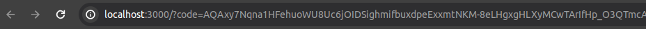

# Projeto Extract & Load - Spotify

O projeto tem como objetivo desenvolver uma solução para a extração de dados do acervo musical do Spotify utilizando sua API. Após a extração, os dados serão armazenados em um Datalake na plataforma Snowflake.

# Dados extraídos

As extrações variam conforme o perfil de usuário especificado na API do Spotify. Abaixo, segue a lista de todos os endpoints utilizados neste projeto:

* GLOBAL_TOP_TRACKS_DAILY_STREAM
* GLOBAL_TOP_TRACKS_WEEKLY_STREAM
* GLOBAL_VIRAL_TRACKS_DAILY_STREAM
* USER_SAVED_TRACKS_STREAM
* USER_TOP_ARTISTS_LT_STREAM
* USER_TOP_ARTISTS_MT_STREAM
* USER_TOP_ARTISTS_ST_STREAM
* USER_TOP_TRACKS_LT_STREAM
* USER_TOP_TRACKS_MT_STREAM
* USER_TOP_TRACKS_ST_STREAM

# Como executar este projeto

1. Crie um ambiente .venv
2. Instale as bibliotecas do arquivo requirements.txt com o seguinte comando ```pip install -r requirements.txt```.

## Spotify 

Crie ou associe sua conta do Spotify na página de developer, siga os passos para criar um APP para obter as chaves de acesso.

Link: https://developer.spotify.com/documentation/web-api/concepts/apps

1. Obtendo refresh token:
Para obter seu refresh token entre no arquivo ```get_refreshtoken.py```. Altere as informações abaixo de acordo com suas chaves pessoais. 

```python
CLIENT_ID = 'YOU_CLIENT_ID'
CLIENT_SECRET = 'YOU_CLIENT_SECRET'
REDIRECT_URI = 'YOUR_REDIRECT_URI'
```
2. Na janela do navegador que será aberta copie os caracteres depois de: ```code=```


3. Cole o código na caixa de texto que aparecerá em seu terminal.
4. Anote o Refresh Token para as próximas etapas.

## Snowflake

O Snowflake é uma plataforma de armazenamento de dados baseada na nuvem que oferece soluções eficientes para data warehousing e análise de dados. Sua arquitetura única separa armazenamento e computação, permitindo escalabilidade e flexibilidade. Compatível com AWS, Azure e Google Cloud, o Snowflake suporta uma ampla gama de formatos de dados e é conhecido por sua facilidade de uso e segurança robusta.

Crie uma conta free no snowflake: https://www.snowflake.com/pt_br/

1. Crie um database com o nome de sua preferência (Ao criar selecione a Role ACCOUNTADMIN).
2. Crie um schema com nome "raw".

***OBS: A criação da conta requer um cartão de crétido, o projeto pode gerar custos, tenha atenção antes de prosseguir.***

## Meltano

Meltano é uma ferramenta de integração de dados de código aberto que facilita o processo de ELT (Extract, Load, Transform) para engenheiros de dados. Permite automação completa de pipelines de dados, desde a extração até a transformação e suporta múltiplas fontes e ferramentas através de plugins.

Desta maneira iremos utilizá-lo no processo de Extract e Load.

1. Crie um database e um schema em seu Snowflake.

2. Alterando variáveis de ambiente Snowflake. Navegue até o arquivo ```meltano-api-spotify>meltano.yml``` e altere as variáveis de ambiente de acordo com os dados da sua conta do Snowflake. 

```yml
   account: 'YOUR_ACCOUNT'
      add_record_metadata: false
      database: YOUR_DATABASE
      schema: YOUR_SCHEMA
      load_method: overwrite
      warehouse: COMPUTE_WH
      user: YOUR_USER
      role: ACCOUNTADMIN
```

3. Build da imagem meltano.
* Certifique-se de estar na pasta meltano-api-spotify.
* Execute o seguinte comando: ```docker build -t meltano . ```
* Espere o processo encerrar.

## Airflow

O Apache Airflow é uma plataforma de código aberto usada para orquestrar fluxos de trabalho complexos e automação de processos. Permite aos usuários programar, agendar e monitorar fluxos de trabalho como sequências de tarefas, usando uma interface gráfica ou código Python. Com uma arquitetura flexível e extensível, Airflow é amplamente utilizado para gerenciar pipelines de dados, garantindo que as tarefas sejam executadas na ordem e condições corretas.

1. Navegue até a pasta `airflow`.
2. Execute o comando `docker compose up -d`.
3. Abra uma aba no navegador e entre em: localhost:8080
4. Usuário e senha padrão: airflow
5. Adicionado pool: Navegue no menu superior `Admin>Pools`. Adicone a pool `meltano_pool` e configure 2 slots.
6. Adicionando variáveis de ambiente: 
Navegue `Admin>Variables` e adicone as seguintes variáveis de ambiente seguido dos seu valores.

**SPOTIFY**

```python
CLIENT_ID
CLIENT_SECRET
REFRESH_TOKEN
```
**SNOWFLAKE**

```python
TARGET_SNOWFLAKE_PASSWORD
```	

## Executando a DAG

Agora você está pronto para executar sua DAG, trigger ela e verifique se os dados estão sendo inseridos em seu Snowflake.

## Tecnologias utilizadas

* Snowflake
* Meltano
* Airflow

## Liguagens utilizadas

* Python

### Autor
Willian Ribeiro dos Santos

[](https://www.linkedin.com/in/willianrsantos/) 